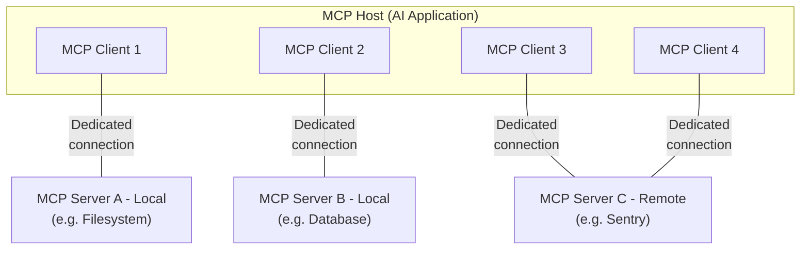

# Model Context Protocol - MCP 

## MCP Architecture Overview

The Model Context Protocol follows a client-host-server architecture: This separation of concerns allows for modular, composable systems where each server can focus on a specific domain (like file access, web search, or database operations).

- **MCP Host:** The AI application that coordinates and manages one or multiple MCP clients.
- **MCP Client:** A component that maintains a connection to an MCP server and obtains context from an MCP server for the MCP host to use.
- **MCP Server:** A program that provides context, such as tools, resources (data), or prompts to MCP clients.

